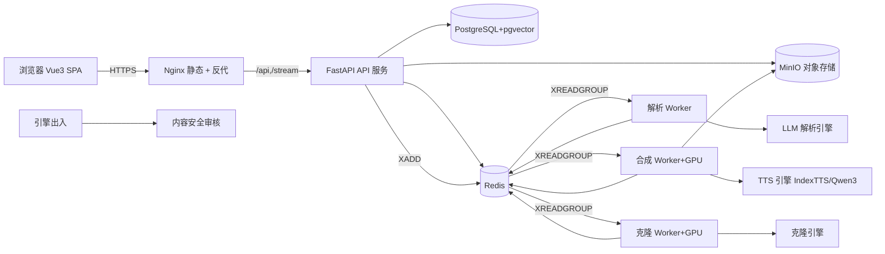

# 有声书智能制作平台 项目架构设计（Project Architecture）

| 文档版本 | V1.0 |
| --- | --- |
| 关联文档 | 需求文档 V2.0（docs/需求文档.md）、开发设计文档 V1.1（docs/设计文档.md） |
| 编写日期 | 2026-09-30 |
| 适用范围 | 架构、后端、前端、算法、运维、测试 |
| 文档状态 | 架构评审稿 |

> 本文档在《设计文档 V1.1》基础上，聚焦**项目级架构**：技术栈、目录结构、模块边界、部署拓扑与开发约定。接口级定义见《接口文档》（docs/接口文档.md）。
>
> **技术栈决议**：前端 Vue 3 + Vite + TypeScript；后端全栈 Python（FastAPI），API 与 Worker 同语言；无高并发需求，不引入 Go/Java。

---

## 1. 技术栈总览

| 层 | 选型 | 说明 |
| --- | --- | --- |
| 前端框架 | Vue 3（`<script setup>` + TS） | 组合式 API，类型安全 |
| 构建工具 | Vite | 快启、HMR、静态构建 |
| UI 组件库 | Element Plus | 表单/表格/弹窗/上传等开箱即用；创意类组件可换 Naive UI |
| 状态管理 | Pinia | 作品/角色/音色/任务/用户 等 store |
| 路由 | Vue Router 4 | 页面级路由 + 鉴权守卫 |
| HTTP 客户端 | axios / ofetch | 统一拦截器（鉴权、错误信封、loading） |
| SSE 客户端 | 原生 `EventSource` / `fetch` 流式 | 任务进度、日志推送 |
| 后端框架 | FastAPI（Python 3.11+） | async，自动 OpenAPI，Pydantic v2 |
| 鉴权 | JWT（OAuth2 密码流） + bcrypt | 无状态，SSE 复用同一 token |
| ORM | SQLAlchemy 2.x（async） | 对应设计文档 DDL |
| 迁移 | Alembic | 版本化 schema |
| 向量 | pgvector（PostgreSQL 扩展） | 跨块角色检索 |
| 对象存储 | MinIO（S3 兼容）/ 云 OSS | 原文本/音频/样本/模型 |
| 缓存/队列/进度 | Redis | 缓存、Redis Stream 任务队列、进度缓存 |
| 任务消费 | Python Worker（消费 Redis Stream） | 解析/合成/克隆独立进程 |
| 音频处理 | ffmpeg / pydub | 拼接、响度归一、降噪、格式转换 |
| 引擎适配 | Python（GPU 推理） | LLM 解析、IndexTTS/Qwen3-TTS、克隆、内容审核 |
| 后端包管理 | **uv（Python）** | 依赖解析 + 虚拟环境 + 锁文件（uv.lock），统一替代 pip/venv/requirements.txt |
| 前端包管理 | **pnpm** | 快、省磁盘、严格依赖隔离，替代 npm/yarn |
| 容器 | Docker + docker-compose / K8s | 前端 Nginx 托管 + 后端多服务编排 |

### 1.1 为什么这样选

- **Vue3 + Vite + TS**：组合式 API 适合三栏校对台等复杂交互态；Vite 构建快；TS 与后端 Pydantic schema 可双向对齐，降低联调成本。
- **全栈 Python / FastAPI**：本项目无高并发（目标 500 在线、100 并发合成），FastAPI 的 async 足够；API 与 Worker 同语言，引擎适配层（也是 Python）可直接复用，免去 Go/Python 双栈与 gRPC 序列化成本。
- **Redis Stream 而非 Kafka**：任务量中等，Redis Stream 轻量、自带消费组与重试，运维简单；若未来量增可平滑迁移至 Kafka。
- **SSE 而非 WebSocket**：进度是单向服务端→客户端，SSE 断线重连简单，浏览器原生 `EventSource` 即可，认证走 `?token=` 或 header。
- **uv + pnpm 包管理**：后端用 uv（Rust 实现，安装/解析极快，锁定 uv.lock 可复现）；前端用 pnpm（内容寻址存储、严格 node_modules），统一团队工程体验与可复现构建。

---

## 2. 系统架构（拓扑）



要点：
- **Nginx** 同时托管前端 `dist/` 与反代后端；开发期可用 Vite dev server 直接代理。
- **API 服务无阻塞**：长任务只做"落库 + XADD 入队 + 返回 task_id"，进度由 Worker 写 Redis 并通过 SSE 端点对外流。
- **Worker 水平扩容**：三类 Worker 可各起多个实例，消费组自动分摊。

---

## 3. 后端目录结构（Python / FastAPI）

```text
backend/
├── app/
│   ├── main.py                # FastAPI 入口：挂载路由/SSE/静态、CORS、异常、生命周期
│   ├── core/
│   │   ├── config.py          # pydantic-settings：DB/Redis/MinIO/引擎地址/密钥
│   │   ├── security.py        # JWT 签发校验、密码哈希、当前用户依赖
│   │   ├── db.py              # async engine / session / Base
│   │   ├── redis.py           # redis 连接池 + stream 封装（produce/consume）
│   │   ├── errors.py          # 统一异常 → HTTP 错误信封
│   │   ├── sse.py             # SSE 广播/订阅（按 task_id 频道）
│   │   └── storage.py         # MinIO 封装（上传/下载/临时 URL）
│   ├── models/                # SQLAlchemy ORM（对应设计文档 §6 DDL）
│   │   ├── work.py chapter.py paragraph.py segment.py
│   │   ├── role.py voice.py bind.py
│   │   ├── task.py audio_asset.py clone_auth.py
│   │   └── user.py
│   ├── schemas/               # Pydantic v2 请求/响应（按模块划分）
│   │   ├── work.py role.py voice.py parse.py synth.py task.py auth.py ...
│   ├── routers/               # 路由层（薄，仅参数校验 + 调 service）
│   │   ├── auth.py works.py files.py parse.py roles.py
│   │   ├── voices.py clone.py bindings.py synth.py
│   │   ├── tasks.py proofread.py system.py notify.py
│   ├── services/              # 业务逻辑（不含 HTTP）
│   │   ├── work_service.py file_service.py parse_service.py
│   │   ├── role_service.py voice_service.py clone_service.py
│   │   ├── synth_service.py proofread_service.py task_service.py
│   ├── workers/               # 独立进程入口（消费 Redis Stream）
│   │   ├── base.py            # 消费组/心跳/确认/失败重试骨架
│   │   ├── parse_worker.py synth_worker.py clone_worker.py
│   ├── engines/               # 引擎适配层（Python + GPU）
│   │   ├── llm/               # 解析适配器（提示词框架、角色词典注入）
│   │   ├── tts/               # base.py(Protocol) index_tts.py qwen3_tts.py
│   │   ├── clone/             # 训练/推理适配器
│   │   └── moderation/        # 内容安全审核
│   ├── tasks/                 # 任务派发 + 状态机 + 进度（Task 表 + redis）
│   │   └── dispatch.py progress.py
│   └── migrations/            # Alembic 迁移脚本
├── tests/                     # pytest（单元 + 接口 + 引擎 mock）
├── pyproject.toml             # uv 管理：依赖与工具配置
├── uv.lock                    # uv 锁文件（可复现）
├── Dockerfile                 # 多阶段：uv sync(build) / worker
└── .env.example
```

分层约束：
- **routers 薄**：只做参数绑定、鉴权依赖、调 `services`，不直接写 SQL 或调引擎。
- **services 纯业务**：可单测，不依赖 HTTP；跨模块复用。
- **workers 只跑长任务**：从 Redis Stream 取消息 → 调 services/engines → 写 Task/进度。
- **engines 隔离**：所有模型推理收敛在 `engines/`，业务层只依赖 `TTSEngine` 等 Protocol。

---

## 4. 前端目录结构（Vue 3 + Vite + TS）

```text
web/
├── index.html
├── package.json              # pnpm 管理
├── pnpm-lock.yaml            # pnpm 锁文件
├── .npmrc                     # pnpm 配置（如 shamefully-hoist 按需）
├── vite.config.ts             # 代理 /api、/stream 到后端；路径别名
├── tsconfig.json
└── src/
    ├── main.ts                # 挂载 App、Pinia、Router、ElementPlus
    ├── App.vue
    ├── router/
    │   └── index.ts           # 路由表 + 鉴权守卫（需登录态）
    ├── stores/                # Pinia（按域）
    │   ├── user.ts work.ts role.ts voice.ts
    │   ├── task.ts proofread.ts
    ├── api/                   # 按模块封装（对齐接口文档）
    │   ├── request.ts         # axios 实例：token、错误信封、重试
    │   ├── auth.ts works.ts files.ts parse.ts roles.ts
    │   ├── voices.ts clone.ts bindings.ts synth.ts tasks.ts system.ts
    ├── composables/
    │   ├── useSSE.ts          # EventSource 封装：自动重连、频道订阅
    │   ├── useTaskProgress.ts # 绑定 task_id → 进度/日志
    │   └── useProofread.ts    # 三栏工作台协同态
    ├── components/
    │   ├── AudioPlayer.vue    # 试听/进度/倍速
    │   ├── TagSelect.vue      # 音色标签组合检索
    │   ├── ConfidenceBadge.vue# 低置信高亮
    │   └── ProgressBar.vue
    ├── views/                 # 页面（对应 PRD §7 页面清单）
    │   ├── WorkList.vue Upload.vue
    │   ├── Proofread.vue      # 三栏工作台（核心）
    │   ├── RoleManage.vue VoiceLibrary.vue
    │   ├── SynthConsole.vue Export.vue Settings.vue
    ├── types/                 # TS 类型（与后端 schemas 对齐）
    │   └── index.ts
    └── styles/
```

前端约束：
- **api/ 单一出口**：所有请求经 `request.ts`，后端错误信封统一弹 toast。
- **stores 不直连引擎**：仅缓存视图态与列表；写操作走 api。
- **进度走 SSE**：`useTaskProgress` 订阅 `GET /tasks/{id}/stream`，不轮询。

---

## 5. 模块职责边界

| 模块 | 后端归属 | 前端归属 | 边界说明 |
| --- | --- | --- | --- |
| 作品管理 | `works.py` + `work_service` | `WorkList/Upload` + `work` store | 状态机在 service 维护 |
| 文件/上传 | `files.py` + `file_service` | `Upload.vue` | 分片上传由前端切，后端合并 |
| 解析 | `parse.py`(提交) + `parse_worker` | 进度页 | 长任务在 Worker，API 仅派发 |
| 角色/画像 | `roles.py` + `role_service` | `RoleManage.vue` | 词典由 Worker 回写 |
| 音色库 | `voices.py` + `voice_service` | `VoiceLibrary.vue` | 标签检索走 PG 索引 |
| 克隆 | `clone.py` + `clone_worker` | 克隆向导 | 合规前置在 service 校验 |
| 绑定 | `bindings.py` + `synth_service` | 合成控制台 | 角色-音色-参数 |
| 合成 | `synth.py`(提交) + `synth_worker` | `SynthConsole.vue` | 样章先行 `scope` 参数 |
| 校对 | `proofread.py` + `proofread_service` | `Proofread.vue` | 三栏协同、自动保存 |
| 任务/SSE | `tasks.py` + `tasks/` | `useTaskProgress` | task_id 维度进度 |
| 系统 | `system.py` + `notify` | `Settings.vue` | 配置/通知/日志 |

---

## 6. 存储与数据架构

- **PostgreSQL + pgvector**：关系数据（work/chapter/paragraph/segment/role/voice/bind/task/audio_asset/clone_auth/user）+ 向量（`role_embedding` 跨块检索）。
- **MinIO（S3 兼容）**：原文本、清洗后文本、音频片段、样章/全本音频、克隆样本、模型产物。对象 key 与 DB 记录一一对应。
- **Redis**：① 缓存（音色标签、角色词典热数据）；② Stream 任务队列（三类 Worker 消费组）；③ 进度缓存（Task 实时进度/日志，供 SSE 读取）。
- **Migrations**：Alembic 管理 schema；向量列随 pgvector 扩展创建。

> 计费相关字段首期不建表，仅在 `work`/`task` 预留扩展位（M4）。

---

## 7. 部署拓扑

### 7.1 docker-compose（开发/中小规模）

```yaml
services:
  web:          # Nginx 托管 dist/，反代 /api /stream
  api:          # FastAPI（多 worker 进程/uvicorn）
  worker-parse: # 解析 Worker
  worker-synth: # 合成 Worker（挂载 GPU）
  worker-clone: # 克隆 Worker（挂载 GPU）
  postgres:     # + pgvector
  minio:        # 对象存储
  redis:        # 缓存/队列/进度
```

- GPU 仅挂载到 `worker-synth` / `worker-clone`；`api` / `worker-parse` 可用 CPU。
- 前端 `vite build` → `dist/` 由 Nginx 托管；生产 `web` 镜像内含 Nginx。

### 7.2 生产建议

- K8s：前端 Deployment（Nginx）+ 后端 Deployment（api）+ Worker Deployment（可 HPA 按队列深度扩容）。
- 配置中心管理：引擎地址、并发上限、审核策略、SSE 超时。
- 监控：队列深度、GPU 利用率、合成失败率、接口 P95；告警接入。
- 备份：PostgreSQL 日备≥30 天；MinIO 版本化；Redis 仅缓存可重建。

---

## 8. 关键设计决策与权衡

| 决策 | 选择 | 权衡 |
| --- | --- | --- |
| 前端框架 | Vue3+Vite+TS | 复杂交互态友好；若团队惯 React 可换，但已决议 Vue |
| 后端语言 | Python/FastAPI 统一 | 放弃 Go 极致性能，换取统一栈与引擎复用；本项目并发足够 |
| 任务队列 | Redis Stream | 轻量；高吞吐场景弱于 Kafka，可平滑迁移 |
| 进度推送 | SSE | 单向简单；需双向信道（如协作 M4）再引 WebSocket |
| ORM | SQLAlchemy async | 与 FastAPI async 一致；复杂原生 SQL 用 text() |
| 文件上传 | 前端分片 + 后端合并 | 大文件稳定；增加前端切片逻辑 |
| 引擎隔离 | Protocol 适配层 | 新增引擎（云 TTS）只加 adapter，业务零改 |

---

## 9. 开发规范与约定

1. **API 版本**：路径前缀 `/api/v1`；破坏性变更升版本。
2. **鉴权**：除登录/注册/公开资产配置外，均需 `Authorization: Bearer <JWT>`；SSE 走 `?token=`。
3. **错误信封**：统一 `{ "code": "STRING", "message": "...", "request_id": "..." }`，HTTP 状态码语义化（见接口文档错误码表）。
4. **分页**：列表接口 `?page=&page_size=`，响应含 `items / total / page / page_size`。
5. **幂等**：任务提交携带客户端 `idempotency_key`，重复提交返回同一 task。
6. **命名**：后端 `snake_case`、前端 `camelCase`；TS 类型由 Pydantic schema 手动对齐（或 codegen）。
7. **迁移**：schema 变更走 Alembic，禁止手工改库。
8. **日志**：结构化日志（json），关键操作（创建/删除/合成/导出/克隆）留痕≥180 天。
9. **测试**：service 单测 + 接口集成测试（pytest + httpx TestClient）+ 引擎 mock；CI 必过。

### 9.10 依赖与本地运行命令

**后端（uv）**
- 安装/同步依赖：`uv sync`
- 启动 API：`uv run uvicorn app.main:app --reload`
- 跑 Worker：`uv run python -m app.workers.parse_worker`（合成/克隆同理）
- 数据库迁移：`uv run alembic upgrade head`
- 测试：`uv run pytest`

**前端（pnpm）**
- 安装依赖：`pnpm install`
- 开发：`pnpm dev`（Vite dev server，代理 `/api`、`/stream`）
- 构建：`pnpm build`（产出 `dist/`）
- 校验：`pnpm lint` / `pnpm typecheck`

---

## 10. 环境矩阵

| 环境 | 前端 | 后端 | 引擎 | 存储 |
| --- | --- | --- | --- | --- |
| 本地 dev | `pnpm dev`(5173) + 代理 | `uv run uvicorn ... --reload` | 本地/云 LLM、本地 TTS | 本地容器（uv run / compose） |
| 测试 | 构建 dist | 测试服务 | 云 API（隔离账号） | 测试库 |
| 生产 | Nginx 托管 | 多副本 + Worker | GPU 节点 | 主从 + 对象存储 |

---

## 11. 风险与开放问题（架构视角）

- **API 单点**：无高并发下可接受；若需高可用，api 多副本 + Redis 共享状态即可（已无本地状态）。
- **Worker 崩溃丢消息**：Redis Stream 未 ACK 消息可由其他消费者重放；Task 状态持久化保证可恢复。
- **前端包体积**：Element Plus 按需引入（unplugin-auto-import）控制体积。
- **引擎依赖体积**：TTS/克隆镜像较大，独立构建与缓存层。
- **开放问题**：详见设计文档 §12（本地 TTS 实测能力、克隆模型选型、LLM 选型与成本、字幕时间轴精度、并发与 GPU 规格）。

---

> 配套文档：《接口文档》（docs/接口文档.md）定义所有 REST 端点、SSE 约定与错误码。
