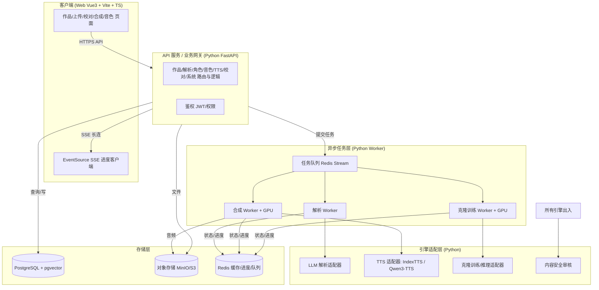
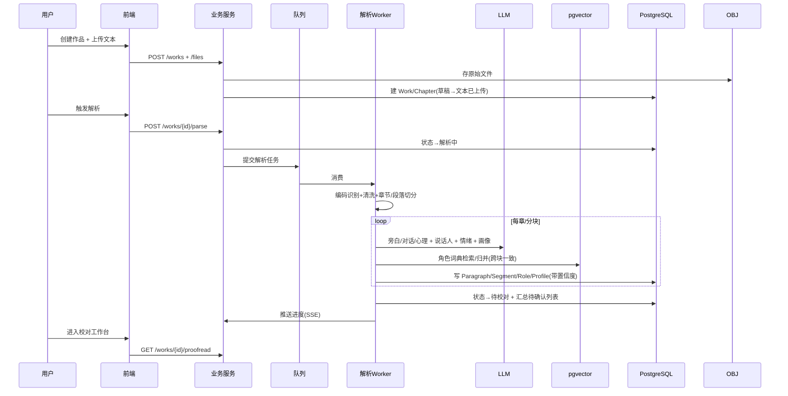
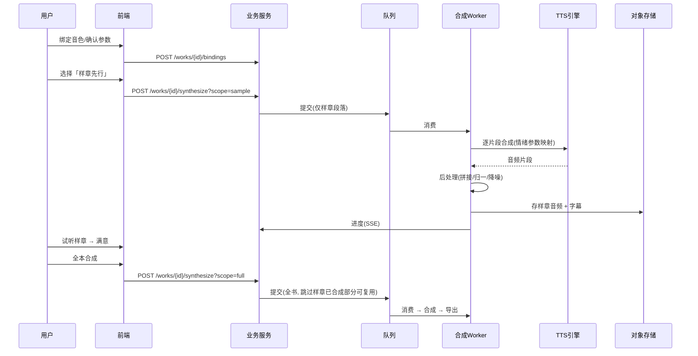
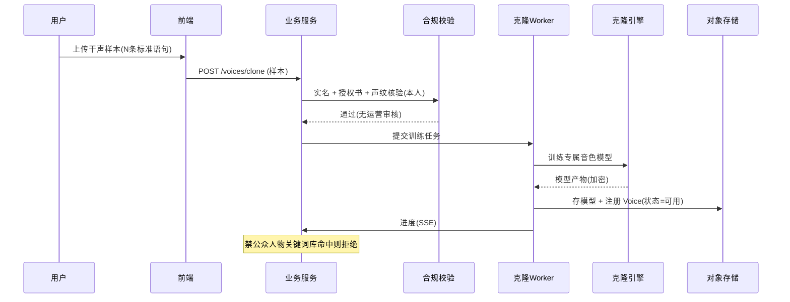

# 有声书智能制作平台 开发设计文档（Technical Design）

| 文档版本 | V1.1 |
| --- | --- |
| 关联 PRD | 需求文档 V2.0（docs/需求文档.md） |
| 编写日期 | 2026-09-30 |
| 适用范围 | 架构、后端、算法、前端、运维、测试 |
| 文档状态 | 设计评审稿 |

> 本设计文档基于 PRD V2.0 的**已决议项**展开。关键约束（首期）：音频闭环 + 情绪分析；解析 LLM 直出 + 工程兜底；TTS 本地开源引擎（IndexTTS / Qwen3-TTS）；声音克隆自研、仅用户上传样本自助、无运营审核；**不做**计费、版权承诺/侵权投诉、视频生成（M3）、关系图谱（M2）、团队协作（M4）；新增**样章先行**。
>
> **技术栈（本轮决议）**：前端 **Vue 3 + Vite + TypeScript**（Element Plus + Pinia + Vue Router + SSE 客户端）；后端全栈 **Python**，API 网关/业务服务与异步 Worker 统一使用 **FastAPI**（无高并发需求，不再引入 Go），Worker 消费 Redis Stream 执行长任务；存储层 PostgreSQL + pgvector / MinIO / Redis 不变。

---

## 1. 文档概述

### 1.1 目的

将 PRD 的"做什么"翻译为"怎么做"：明确系统架构、模块边界、核心流程、数据模型、关键算法、非功能设计与部署方案，作为研发与排期的依据。接口级定义见配套《接口文档》。

### 1.2 设计原则

1. **异步优先**：所有长任务（解析/合成/克隆）异步化，状态机驱动，SSE 推送进度。
2. **引擎可插拔**：TTS / LLM / 克隆均通过适配器接入，业务不直接依赖具体模型。
3. **人工兜底**：AI 结果带置信度，低置信度进待确认列表，人工裁定优先。
4. **长文本工程兜底**：分块 + 角色词典 + 向量检索，保证跨章一致性。
5. **合规前置**：克隆实名/授权书/声纹/禁公众人物/水印在 MVP 即内置。

---

## 2. 范围与约束

### 2.1 首期范围（MVP + M1.5）

| 域 | 范围 |
| --- | --- |
| 作品 | 创建/列表/状态/编辑/复制/回收站 |
| 文本 | 上传(txt/md/docx/epub)、编码识别、清洗、章节/段落切分、原文对照、增量追加 |
| 解析 | 旁白/对话/心理分离、说话人识别、情绪分析、角色画像、龙套兜底 |
| 音色 | 内置音色、标签体系、角色-音色匹配、**自研克隆（用户上传样本自助）** |
| 合成 | 多角色多语音、情绪参数映射、批量/重试/断点续传、后处理、字幕、导出、**样章先行** |
| 校对 | 三栏工作台、类型着色、低置信度高亮、快速修改、自动保存 |
| 系统 | 账号/权限/通知/日志/系统配置、内容安全审核 |

### 2.2 明确不在首期

计费配额、版权承诺/侵权投诉、PDF 解析、视频成片、人物关系图谱、团队协作/审核流、移动端编辑。

---

## 3. 总体架构

### 3.1 架构图



### 3.2 分层与职责

| 层 | 技术选型 | 职责 |
| --- | --- | --- |
| 客户端 | **Vue 3 + TypeScript + Vite** + Element Plus；SSE 客户端（EventSource） | 页面、三栏校对、进度展示、Pinia 状态管理、Axios/OFetch API 封装 |
| API 网关/业务 | **Python (FastAPI)** + JWT（OAuth2 密码流）；依赖注入组织业务逻辑 | 业务逻辑、任务提交、查询、权限、SSE 进度端点 |
| 异步 Worker | **Python（与 API 同语言，消费 Redis Stream）** | 解析/合成/克隆长任务 |
| 引擎适配 | Python 推理服务 + GPU | LLM/TTS/克隆/审核适配 |
| 存储 | PostgreSQL + pgvector / MinIO / Redis | 关系/向量/对象/缓存 |
| 队列 | Redis Stream | 任务分发、削峰、进度缓存 |

> 技术栈统一为 Python：前端 Vue3 + Vite + TS，后端 API 与 Worker 均 FastAPI/Python，避免 Go/Java 双栈运维；本项目无高并发需求，FastAPI（async）足以支撑，长任务通过 Redis Stream 派发给独立 Worker，API 进程不被阻塞。

### 3.3 关键技术决策

| 决策 | 选择 | 理由 |
| --- | --- | --- |
| 技术栈统一 | 前端 Vue3+Vite+TS，后端 FastAPI/Python | 无高并发需求，统一栈降低运维与协作成本 |
| TTS | 本地 IndexTTS / Qwen3-TTS | 降本、可控、数据不出域 |
| 解析 LLM | 大模型（本地 vLLM 或云 API） | 语义判断能力强 |
| 向量库 | pgvector | 复用 PostgreSQL，低运维 |
| 进度推送 | SSE（FastAPI `StreamingResponse`） | 单向流式、断线重连简单，前端 EventSource 原生支持 |
| 音频后处理 | ffmpeg / pydub（sox） | 拼接/归一/降噪成熟 |
| 字幕 | TTS 时间戳 + 强制对齐（如有） | 保证音画/字幕同步 |

---

## 4. 核心流程设计时序

### 4.1 上传 → 解析 → 校对



### 4.2 多角色 TTS 合成 + 样章先行



### 4.3 声音克隆（用户自助）



---

## 5. 模块详细设计

### 5.1 作品与文件服务

- **职责**：作品 CRUD、状态机、文件上传（分片/拖拽/多文件合并）、编码识别、文本清洗、章节/段落切分、原文对照、增量追加。
- **编码识别**：`chardet`/iced + 常见中文编码探测，失败回退人工选择。
- **章节切分**：正则 + 启发式识别「第X章/节/卷/序章/番外/楔子」，输出 `Chapter{title, order, rawText}`；人工可合并/拆分/重排。
- **段落切分**：按换行 + 语义边界（标点、引号闭合），单段 ≤500 字。
- **原文对照**：存储 `rawText` 与 `structured` 双向 offset 映射，支持定位跳转。
- **增量追加**：新章节追加为独立 `Chapter`，不重建已有 `Segment`，已合成音频不受影响（FR-208）。

### 5.2 解析服务（LLM + 工程兜底）

**分块策略**
- 单元：章节 → 段落；超长章节再按 ~2000 字语义窗切片，每片携带「章节上下文头」（书名/角色词典摘要）。
- 并行：章节级并行；块级受 LLM 上下文限制串行或受限并行。

**角色词典（跨块一致性核心）**
- 首轮抽取全局角色实体（名/别名/称谓/代称），写入 `Role` 与别名表，建立 `role_alias`。
- 后续每块解析前注入「当前已知角色词典」作为 few-shot/约束，要求 LLM 复用既有角色 ID，禁止每块独立新建。
- 代称/共现歧义：向量检索相邻上下文段落嵌入，辅助消歧；低置信进待确认。

**说话人识别**
- 引导语（「X说道」）规则优先，高置信直接归属。
- 无引导语：LLM 语义 + 对话轮次 + 角色共现启发式；输出置信度。
- 未知角色：生成 `未知角色N`，支持人工指派/新建（FR-314）。
- 龙套兜底：台词量 < 阈值自动标 `level=龙套`，合成走默认旁白/群杂，不逐一绑音色（FR-320）。

**情绪分析**
- 片段级 LLM 打标：情绪标签 + 强度(1–5) + 语气描述 + 语速/音量建议。
- 输出可解释依据（命中线索），便于校对。

**置信度与待确认**
- 每 `Segment` 存 `confidence`；低于阈值（如 <0.7）标记 `low_conf=true`，汇总到待确认列表（FR-352）。

**兜底原则**：规则层处理确定性结构（引号/破折号）；LLM 层处理语义；人工最终裁定且不被自动覆盖。

### 5.3 角色与画像服务

- **画像生成**：性别/年龄段/身份/职业/性格标签/说话风格/音色适配标签（FR-331~334）。
- **角色分级**：按台词量（主/次/龙套），龙套走兜底（5.2）。
- **角色卡**：画像 + 出场统计 + 台词 + 关系(占位) + 绑定音色（FR-336）。
- **编辑**：属性/参考图/适配标签可改；修改触发重新推荐音色（FR-337/339）。
- **冲突检测**：主角色音色重复/相似过高提示（FR-340/427）。

### 5.4 音色库与克隆服务

**内置音色**：预置音色，按标签维度分类，存 `Voice{type=内置,...}`，绑定本地 TTS 引擎 voice id。

**标签体系**：`VoiceTag{dim, value, group, scope}`，多对多 `voice_tag_rel`；支持 AND/OR 组合检索（FR-414）。

**角色-音色匹配**：按角色画像标签与音色标签求交，Top-N + 匹配度评分（命中标签解释）（FR-421/422）。

**声音克隆（自研，用户自助，无运营审核）**
- 流程：上传样本 → 预处理（降噪/切句/格式统一）→ 合规前置（实名+授权书+声纹核验）→ 训练（自研模型产出音色模型，加密存储）→ 注册 `Voice{type=克隆, status=可用}`。
- **禁公众人物**：样本/授权书文本过公众人物关键词库 + 必要时人脸/声纹比对，命中即拒。
- **水印**：生成音频注入隐式水印（便于溯源/一键下线）。
- **安全**：样本加密、模型加密、操作日志留痕（≥180天）。
- **资源**：训练为 GPU 任务，入队 + 配额；单音色训练成本/耗时需在模型选型后测算（见成本模型）。

**心理描写音色**：默认跟随角色自身音色 + 内敛/轻柔参数预设；可单独切为旁白音色（FR-426，已修正歧义）。

### 5.5 TTS 合成服务

**引擎抽象层（关键）**

```python
from dataclasses import dataclass, field
from typing import Optional, List, Protocol


@dataclass
class EngineCap:
    speed: bool = False          # 是否支持语速
    pitch: bool = False          # 是否支持音调
    volume: bool = False         # 是否支持音量
    style_tags: List[str] = field(default_factory=list)  # 支持的风格标签
    emotion: bool = False        # 是否支持情绪直控
    intensity: bool = False      # 是否支持强度


@dataclass
class SynthesisRequest:
    text: str
    voice_id: str
    speed: float = 1.0           # 0.5-2.0
    pitch: int = 0              # 相对偏移
    volume: int = 0
    style_tag: Optional[str] = None
    emotion: Optional[str] = None
    intensity: int = 3           # 1-5


@dataclass
class SynthesisResult:
    audio_url: str
    duration: float
    timeline: List[dict] = field(default_factory=list)   # 词级时间轴，字幕对齐


class TTSEngine(Protocol):
    def capabilities(self) -> EngineCap: ...
    def synthesize(self, req: SynthesisRequest) -> SynthesisResult: ...
```

- 适配器 `IndexTTSAdapter` / `Qwen3TTSAdapter` 实现 `TTSEngine`（`@runtime_checkable Protocol` 或抽象基类），统一接入。

- 适配器：IndexTTSAdapter / Qwen3TTSAdapter，统一实现 `TTSEngine`。
- **能力探测**：引擎启动时上报 `Capabilities{speed,pitch,volume,styleTags,...}`；UI 据此开放/禁用调节项（解决本地模型未必支持「气声/颤抖」问题）。

**情绪 → 参数：引擎无关中间表示**
- 定义 `EmotionIR{emotion, intensity, styleTag}`（PRD 附录 B 的映射先转为 IR）。
- 适配阶段按 `Capabilities` 映射：
  - 支持项（speed/pitch/volume）→ 直接映射。
  - 不支持的细腻参数（气声/颤抖）→ 降级为 `styleTag`（若支持），否则标注「该引擎不支持，建议换引擎/后期」，不阻塞。
- 保证同一 `EmotionIR` 在不同引擎下行为尽量一致，便于「样章与全本音色/参数一致」。

**合成编排**
- 入参：全书/选定范围/章节 → 展开为 `Segment` 列表。
- 并发：片段级并发（受 GPU 与单用户配额限制），每片段独立任务，失败自动重试（FR-512）。
- 断点续传：已完成片段结果落库，重跑跳过（FR-513）。
- 后处理：片段拼接 → 静音间隔 → 响度归一化(RNNoise/FFmpeg) → 降噪/去爆音（FR-514）。
- 字幕：TTS 返回时间轴 → 生成 SRT/VTT/LRC（FR-517）。
- 失败率：口径为**片段级**，单片段失败可重试，不计入最终失败（已在 PRD 明确）。

**样章先行（FR-522）**
- 提交合成时 `scope=sample`：仅合成前 1–2 章 `Segment`，产出样章音频 + 字幕。
- 样章与全本使用同一 `Bindings` 与参数；用户满意后 `scope=full` 全本合成，已合成样章片段可复用（缓存命中跳过）。
- 样章不计入最终导出打包（除非用户选择）。

**导出**：MP3/WAV/M4A/AAC，可选采样率/码率（FR-518）；字幕同步导出（FR-517）。

### 5.6 校对工作台（前端 + 轻后端）

- 三栏：左章节树 / 中文本（类型着色、低置信度高亮）/ 右角色·情绪·音色面板（FR-801~803）。
- 快速修改：类型/说话人/情绪/音色（FR-804）；批量操作（FR-805）。
- **自动保存**：每操作增量写 `ProofreadEdit` 或乐观更新 `Segment` 字段 + 修订记录，防丢失（FR-808）。
- 筛选/快捷键/撤销重做（FR-806/807/809）；选中范围预览合成（FR-810）。

### 5.7 异步任务与进度推送（SSE）

- **任务表** `Task{id, workId, type, status, progress, payload, result_ref, created_at}`。
- 状态机：`pending→running→(progress)→success|failed|partial`；失败可重试。
- **队列**：Redis Stream（轻量）/ Kafka（高吞吐）；Worker 消费，更新 `Task` 与 Redis 进度。
- **SSE**：`GET /tasks/{id}/stream` 长连接推送进度/日志；断线前端自动重连并拉取最新 `Task` 状态。
- 持久化：任务状态入库，服务重启可从断点恢复（FR-513，8.2）。

### 5.8 系统 / 权限 / 安全

- **账号**：注册/登录/第三方/找回；实名认证（克隆前置）。权限：超级管理员/运营/创作者/只读（协作者 M4）。
- **通知**：站内信/邮件/短信（任务完成、克隆完成）（FR-903）。
- **日志**：关键操作（创建/删除/合成/导出/克隆）留痕 ≥180 天（FR-904）。
- **系统配置**：默认引擎、并发数、审核策略、参数模板（FR-908）。
- **内容安全审核**：合成/克隆前后调用审核服务，违规拦截 + 日志（FR-521，8.3）。
- **加密**：密码/音色样本/模型加密存储；全站 HTTPS。
- **水印**：生成音频隐式水印（克隆必做，内置音色建议做）。

---

## 6. 数据模型设计

### 6.1 ER（文字）

`Work 1—N Chapter`；`Chapter 1—N Paragraph`；`Paragraph 1—N Segment`；`Work 1—N Role`；`Role 1—1 RoleProfile`；`Role N—N Voice (via Bind)`；`Voice N—N VoiceTag`；`Work 1—N Task`；`Task 1—N AudioAsset`；`User 1—N CloneAuth`；`User 1—N Work(owner)`；`Role 1—N RoleAlias`。

### 6.2 关键表（DDL 摘要）

```sql
-- 作品
CREATE TABLE work (
  id BIGSERIAL PRIMARY KEY,
  name VARCHAR(255) NOT NULL,
  author VARCHAR(128),
  intro TEXT,
  type VARCHAR(64),
  lang VARCHAR(32) DEFAULT 'zh',
  cover_url VARCHAR(512),
  status VARCHAR(32) NOT NULL, -- 状态机
  owner_id BIGINT NOT NULL,
  created_at TIMESTAMPTZ DEFAULT now()
);

-- 章节
CREATE TABLE chapter (
  id BIGSERIAL PRIMARY KEY,
  work_id BIGINT REFERENCES work(id),
  title VARCHAR(255),
  "order" INT,
  raw_text TEXT,
  structured BOOLEAN DEFAULT false
);

-- 段落
CREATE TABLE paragraph (
  id BIGSERIAL PRIMARY KEY,
  chapter_id BIGINT REFERENCES chapter(id),
  "order" INT,
  text TEXT,
  type VARCHAR(16) -- narrative|dialogue|psy
);

-- 片段（合成最小单位）
CREATE TABLE segment (
  id BIGSERIAL PRIMARY KEY,
  paragraph_id BIGINT REFERENCES paragraph(id),
  text TEXT,
  speaker_role_id BIGINT,
  emotion VARCHAR(32),
  intensity SMALLINT,
  style_tag VARCHAR(32),
  confidence NUMERIC(3,2) DEFAULT 1.0,
  low_conf BOOLEAN DEFAULT false,
  audio_asset_id BIGINT,
  timeline JSONB
);

-- 角色 + 别名
CREATE TABLE role (
  id BIGSERIAL PRIMARY KEY, work_id BIGINT, name VARCHAR(128),
  level VARCHAR(16), -- main|minor|extra
  profile_json JSONB, aliases TEXT[]
);
CREATE TABLE role_alias (
  role_id BIGINT, alias VARCHAR(128), PRIMARY KEY(role_id, alias)
);

-- 音色 + 标签
CREATE TABLE voice (
  id BIGSERIAL PRIMARY KEY, name VARCHAR(128), type VARCHAR(16), -- builtin|clone
  engine VARCHAR(32), engine_voice_id VARCHAR(128),
  status VARCHAR(16), owner_id BIGINT, model_ref VARCHAR(512),
  watermark BOOLEAN DEFAULT true
);
CREATE TABLE voice_tag (id BIGSERIAL PRIMARY KEY, dim VARCHAR(32), value VARCHAR(64), "group" VARCHAR(32), scope VARCHAR(16));
CREATE TABLE voice_tag_rel (voice_id BIGINT, tag_id BIGINT, PRIMARY KEY(voice_id, tag_id));

-- 绑定
CREATE TABLE bind (
  role_id BIGINT, voice_id BIGINT, params_json JSONB, PRIMARY KEY(role_id, voice_id)
);

-- 任务
CREATE TABLE task (
  id BIGSERIAL PRIMARY KEY, work_id BIGINT, type VARCHAR(32), -- parse|synth|clone
  status VARCHAR(16), progress INT DEFAULT 0, payload JSONB, result_ref VARCHAR(512),
  created_at TIMESTAMPTZ DEFAULT now()
);

-- 音频资产
CREATE TABLE audio_asset (
  id BIGSERIAL PRIMARY KEY, ref_type VARCHAR(32), ref_id BIGINT,
  url VARCHAR(512), duration NUMERIC(10,2), format VARCHAR(8)
);

-- 克隆授权（无运营审核）
CREATE TABLE clone_auth (
  user_id BIGINT PRIMARY KEY, real_name VARCHAR(128),
  consent_doc_url VARCHAR(512), voiceprint_check BOOLEAN,
  banned_hit BOOLEAN, created_at TIMESTAMPTZ DEFAULT now()
);

-- 用于跨块角色检索的向量
CREATE TABLE role_embedding (
  role_id BIGINT, chunk_ref VARCHAR(256), embedding VECTOR(768)
);
```

> 计费相关字段**首期不建表**，仅在 `work`/`task` 预留 `quota_used` 扩展位（M4）。

---

## 7. 关键算法与提示词策略（解析）

### 7.1 解析提示词框架（分层）

1. **结构层（规则）**：引号/破折号/引导语正则提取，输出候选。
2. **语义层（LLM）**：对规则不确定片段，给片段 + 角色词典 + 上下文，要求输出 JSON：
   `{type, speaker(role_id|未知N), emotion, intensity, style_tag, confidence, evidence}`。
3. **约束**：强制复用角色词典中的 `role_id`；禁止新建未列角色（除非确为未知，命名 `未知N`）。
4. **校验**：JSON Schema 校验 + 置信度阈值；异常片段降级为「待人工」。

### 7.2 情绪映射（IR → 引擎）

- 维护 `emotion_map`：每个情绪×强度 → `EmotionIR{speed,pitch,volume,styleTag}`（源自 PRD 附录 B）。
- 适配阶段按引擎 `Capabilities` 裁剪；不支持项标注并降级。

### 7.3 跨块一致性

- 角色词典 + `role_embedding`（pgvector）检索相邻上下文，消歧代称与共现。
- 全局角色计数与台词统计（FR-318）用于龙套判定与冲突检测。

---

## 8. 非功能设计

### 8.1 性能

- 解析 10 万字 ≤5min（异步，非阻塞）；TTS RTF ≤0.3（本地 GPU）。
- 非长任务接口 ≤800ms；音色标签 1000 条筛选 ≤1s（PG 索引 + Redis 缓存）。
- 并发：≥500 在线用户，≥100 并发合成任务；Worker 水平扩容。

### 8.2 可用性与容错

- 可用性 ≥99.5%；关键任务自动重试；任务状态持久化可恢复。
- 数据每日备份保留 ≥30 天；TTS 多引擎/模型降级（本地故障切备用或云 API）。

### 8.3 安全合规

- 全站 HTTPS；密码/样本/模型加密；操作日志 ≥180 天。
- 克隆：实名+授权书+声纹核验+禁公众人物+水印+留痕+一键下线（无运营审核）。
- 内容安全：生成前后审核拦截。

### 8.4 可扩展性

- TTS/LLM/克隆插件化；解析/合成独立扩容；多语言预留（lang 字段）；M4 开放 API。

---

## 9. 部署与运维

- **容器化**：前端（Vite 构建静态产物，由 Nginx 或 FastAPI 静态挂载）/ API 服务 / 各 Worker 独立镜像，K8s 或 docker-compose 编排。
- **前端托管**：`vite build` 产出 `dist/`；生产由 Nginx 托管并反代 `/api` 与 `/stream` 到 FastAPI；开发期可用 Vite dev server + 代理。
- **GPU 节点池**：合成/克隆 Worker 调度到 GPU 节点；API/解析可 CPU。
- **存储**：PostgreSQL（含 pgvector）主从；MinIO 对象存储；Redis（缓存/队列/进度）。
- **CI/CD**：Git → 镜像构建 → 灰度发布；配置中心管理引擎地址/并发/审核策略。
- **监控**：任务队列深度、GPU 利用率、合成失败率、接口延迟；告警。
- **成本观测**：单本 LLM token、GPU 时长、存储用量（为 M4 计费打基础）。

---

## 10. 里程碑与排期映射（对应 PRD §11）

| 阶段 | 设计重点 |
| --- | --- |
| M1 MVP | 作品/文件/解析/角色/音色(内置)/TTS(本地)/校对/系统；情绪分析；样章先行 |
| M1.5 克隆 | 克隆训练/推理 Worker、合规前置、水印 |
| M2 智能化 | 关系图谱、校对增强、多引擎调度 |
| M3 多模态 | 图像生成、时间轴、视频成片（不在首期） |
| M4 商业化 | 计费(M4评估)、协作、模板、开放能力 |

---

## 11. 风险与技术缓解

| 风险 | 缓解 |
| --- | --- |
| 长文本跨章说话人漂移 | 角色词典 + 向量检索 + 约束提示词 |
| 本地 TTS 情绪参数有限 | 引擎无关 IR + 能力探测 + 降级 |
| 无引导语说话人 <85% | baseline 验证 + 低置信人工兜底 |
| 自研克隆合规 | 实名/授权书/声纹/禁公众/水印/留痕/下线 |
| 克隆训练资源 | GPU 队列 + 配额 + 成本观测 |
| 任务失败 | 自动重试 + 断点续传 + 降级 |
| 长文本流失 | 样章先行 + 分批试听 + 进度推送 |

---

## 12. 开放问题

1. **本地 TTS 实测能力**：IndexTTS / Qwen3-TTS 实际支持的参数集与音质需在 POC 阶段验证，决定情绪映射最终形态。
2. **克隆模型选型**：自研克隆的具体模型/训练数据/单音色耗时待 POC 确定（影响 M1.5 周期）。
3. **LLM 选型与成本**：解析用本地 vLLM 还是云 API，决定成本模型（§16 PRD）与延迟。
4. **字幕时间轴精度**：依赖 TTS 是否返回词级时间戳；否则需强制对齐方案。
5. **并发与 GPU 规格**：单卡并发合成数、是否需要多卡，需压测。

---

> 配套文档：《接口文档》（RESTful API 定义）待产出。
